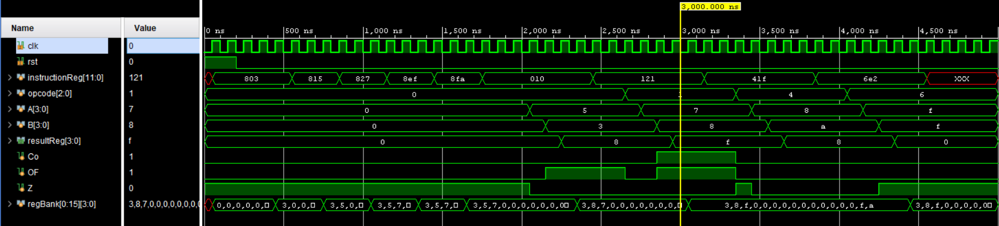

# 4 bit Multi-Cycle Processor using Verilog

## Overview
This project implements a simple **16-register, 4-bit multi-cycle processor** using Verilog HDL.
The processor is controlled by a finite state machine (FSM) and supports basic data movement
and ALU operations.

Designed and implemented as a learning project to understand multi-cycle processor architecture and FPGA-oriented digital design.

The design has been **verified using RTL simulation** and follows fully synthesizable coding
practices, making it suitable for FPGA implementation with minor system-level additions.

---

## Features
- 16 × 4-bit register bank (synchronous read/write)
- 4-bit ALU with flags:
  - Carry (Co)
  - Overflow (OF)
  - Zero (Z)
- Multi-cycle FSM-based control unit
- Program Counter (PC) with enable control
- ROM-based instruction memory

---

## Architecture Overview

### Main Components
- **processor16X4** : Top-level module
- **registerBank**  : 16×4 synchronous register file
- **ALU4bit**       : 4-bit arithmetic and logic unit
- **programCounter**: PC with enable signal
- **instructionMem**: Read-only instruction memory (ROM)
  

### Please refer      for detailed architecture. 

---

## Verification
- Functionally verified using **RTL simulation**
- Simulation validates:
  - MOV operations
  - ALU execution
  - Register writeback
  - PC increment behavior

---

## FPGA Implementation Notes
This design is written using synthesizable Verilog and is suitable for FPGA implementation
(Spartan-7 class devices).

For hardware deployment, the following additions would be required:
- Clock divider (For Debugging)
- Button enable logic (for PC incrementing / manual instruction feed)

---

## Status
-RTL simulation tested  
-FPGA implementation not yet tested  

---

## Simulation Result

This simulation verifies FSM transitions, RAM access and ALU operation using ROM initialized via `.mem`.

---

## Author
Abhirama
